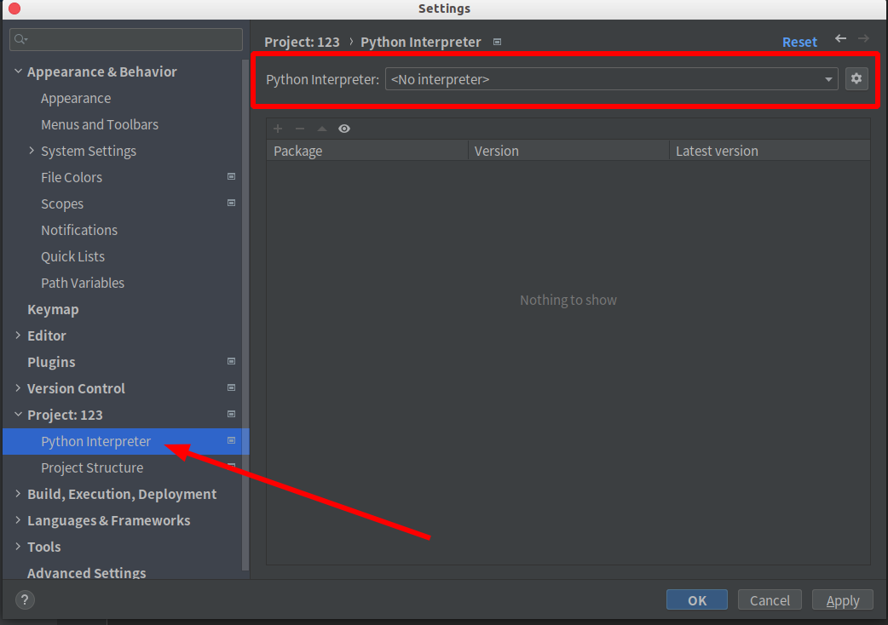
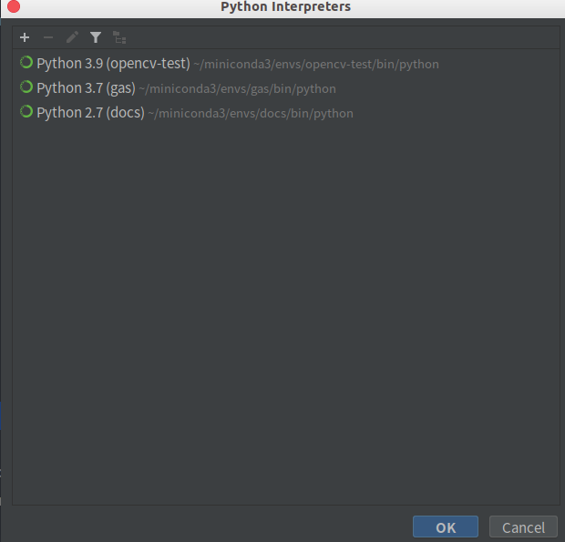
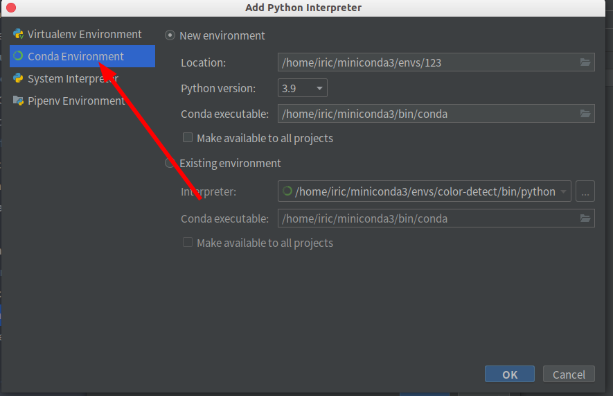
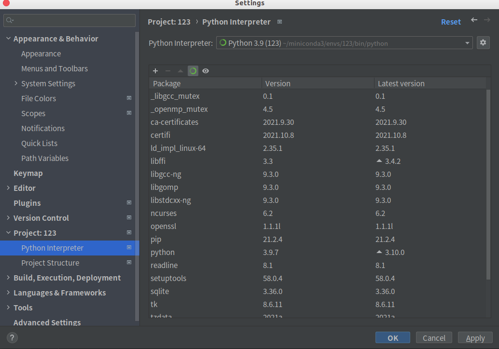
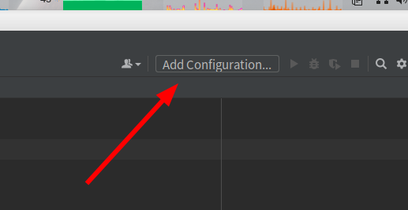
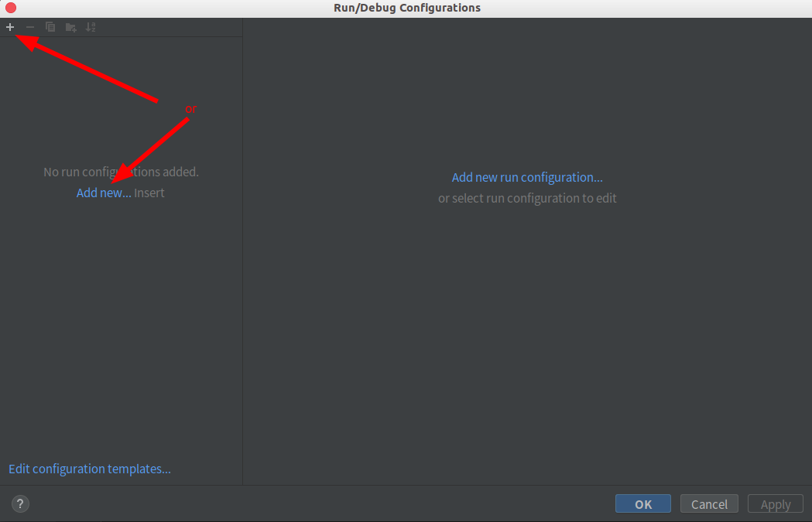
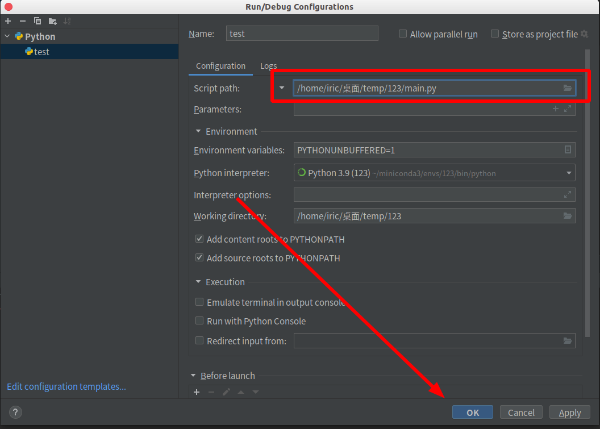

# 配置conda环境

::: tip 前提
系统已经安装了 `conda` ，[相关笔记](../../../编程语言/Python/环境配置/conda/README.md)
:::

## 配置Python解释器

在 `PyCharm` 中通过菜单 `File` -> `Settings` 打开**设置页面**，选择 `Project` 下的 `Python Interpreter` 栏，可以看到如下所示页面，没有设置过**Python解释器**。

接下来点击右上角的**齿轮**按钮，选择 `Show All` ，如下所示：

之后会看到已经加载过的**Python解释器**，（因为我之前加载过，所以这里会有，没有加载过的话，列表为空）如下所示：

如果这里有，选择就好了，如果没有，就点击左上角的 `+` 号，重新配置一个隔离环境，这里可以**创建**一个 `conda` 隔离环境，也可以选择**已有**的隔离环境，如下所示：

这里选择**新建**，点击 `OK` 按钮后弹窗关闭，返回**Python解释器**列表页面，等待隔离环境创建，完成后就能在解释器列表中看到了，如下所示：

选择即可。弹窗关闭，可以看到配置好的解释器环境了，如下所示：

## 配置运行环境

新项目是没有运行环境的，需要配置，在右上角点击 `Add Configuration` ，如下所示：

之后弹出**运行环境列表**弹窗，如下所示：

可以看到目前是没有运行环境的，我们需要新建一个，如上图所示，点击左上角的 `+号` 按钮或者 `Add new...` 都可以，之后选运行环境**类型**，选择 `Python` ，如下所示：

接下来配置运行环境，填写运行环境名称，之后选择运行环境执行脚本，如下所示：

之后就是配置好的运行环境了，点击OK按钮即可，如下所示：

接下来右上角就有了可执行环境了，能运行，能调试了。

