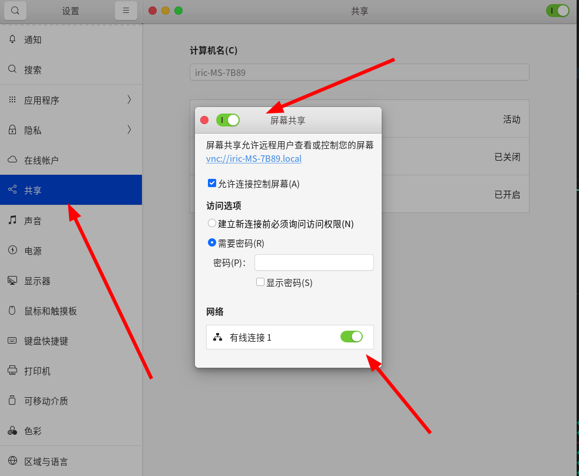
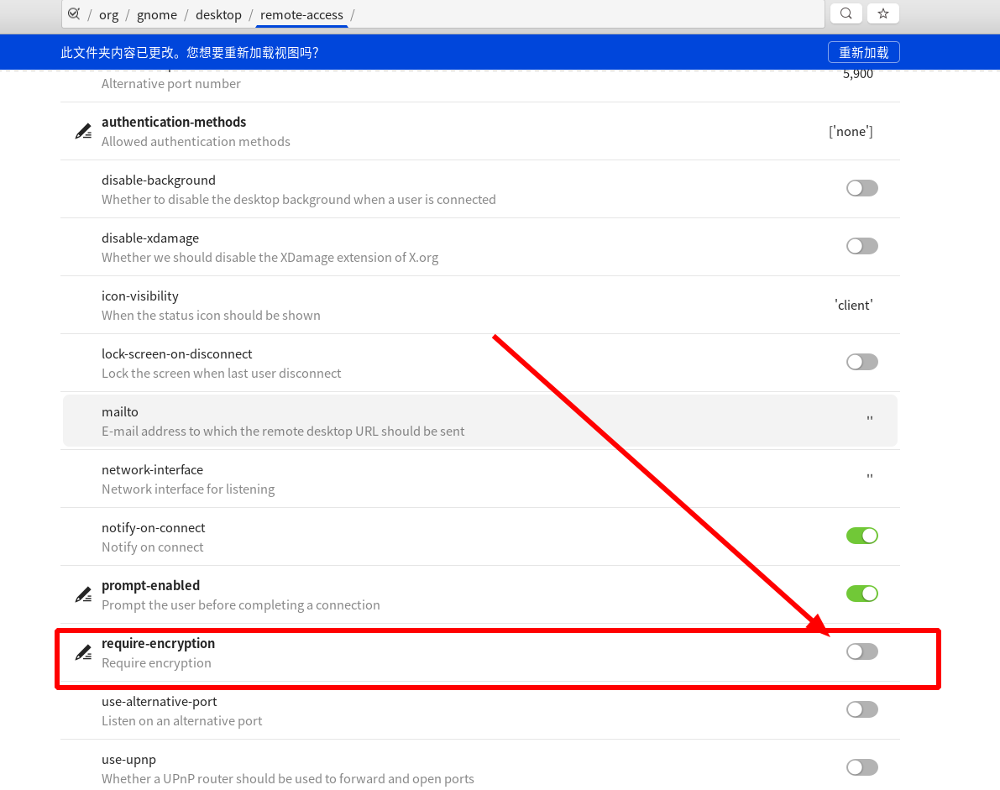

# 远程桌面控制

## 需求场景

想要远程控制 `Ubuntu Desktop` （ `Ubuntu server` 就直接 `ssh` 即可）

## 实现方案

### Xrdp

`Xrdp` 是一个微软远程桌面协议（ `RDP` ）的开源实现，它允许你通过图形界面控制远程系统。通过 `RDP` ，你可以登录远程机器，并且创建一个真实的桌面会话，就像你登录本地机器一样。 `windows` 系统中默认远程登录用的就是 `RDP` 协议，在 `ubuntu` 中安装 `xrdp` 服务意味着在登录 `ubuntu` 远程桌面时可以使用 `windows` 的远程桌面软件。安装步骤如下：

```bash
$ sudo apt install xrdp
$ sudo systemctl status xrdp
● xrdp.service - xrdp daemon
   Loaded: loaded (/lib/systemd/system/xrdp.service; enabled; vendor preset: enabled)
   Active: active (running) since Fri 2022-01-07 18:13:40 CST; 13s ago
     Docs: man:xrdp(8)
           man:xrdp.ini(5)
 Main PID: 28184 (xrdp)
    Tasks: 1 (limit: 4915)
   Memory: 1.8M
   CGroup: /system.slice/xrdp.service
           └─28184 /usr/sbin/xrdp

1月 07 18:13:39 test-04 xrdp[28183]: (28183)(139898876950336)[DEBUG] Testing if xrdp can listen on 0.0.0.0 port 3389.
1月 07 18:13:39 test-04 xrdp[28183]: (28183)(139898876950336)[DEBUG] Closed socket 7 (AF_INET6 :: port 3389)
1月 07 18:13:39 test-04 systemd[1]: xrdp.service: Can't open PID file /run/xrdp/xrdp.pid (yet?) after start: No such file or directory
1月 07 18:13:40 test-04 systemd[1]: Started xrdp daemon.
1月 07 18:13:40 test-04 systemd[1]: /lib/systemd/system/xrdp.service:8: PIDFile= references a path below legacy directory /var/run/, updating /var/run/xrdp/xrdp.pid → /run/xrdp/xrdp.pid; please update the unit file accordingly.
1月 07 18:13:40 test-04 systemd[1]: /lib/systemd/system/xrdp.service:8: PIDFile= references a path below legacy directory /var/run/, updating /var/run/xrdp/xrdp.pid → /run/xrdp/xrdp.pid; please update the unit file accordingly.
1月 07 18:13:40 test-04 systemd[1]: /lib/systemd/system/xrdp.service:8: PIDFile= references a path below legacy directory /var/run/, updating /var/run/xrdp/xrdp.pid → /run/xrdp/xrdp.pid; please update the unit file accordingly.
1月 07 18:13:41 test-04 systemd[1]: /lib/systemd/system/xrdp.service:8: PIDFile= references a path below legacy directory /var/run/, updating /var/run/xrdp/xrdp.pid → /run/xrdp/xrdp.pid; please update the unit file accordingly.
1月 07 18:13:41 test-04 xrdp[28184]: (28184)(139898876950336)[INFO ] starting xrdp with pid 28184
1月 07 18:13:41 test-04 xrdp[28184]: (28184)(139898876950336)[INFO ] listening to port 3389 on 0.0.0.0
```

接下来通过 `windows` 的远程桌面服务就能连接了。

#### 黑屏问题

```bash
$ sudo vim /etc/xrdp/startwm.sh
```

加入文件最后面的 `session` 前面

```ini
unset DBUS_SESSION_BUS_ADDRESS
unset XDG_RUNTIME_DIR
```

最终效果

```ini
if test -r /etc/profile; then
        . /etc/profile
fi

unset DBUS_SESSION_BUS_ADDRESS
unset XDG_RUNTIME_DIR

test -x /etc/X11/Xsession && exec /etc/X11/Xsession
exec /bin/sh /etc/X11/Xsession
```

#### 多次验证

参考文章：https://blog.csdn.net/qq_37556330/article/details/116168449

```bash
$ sudo vim /etc/polkit-1/localauthority/50-local.d/45-allow-colord.pkla
[Allow Colord all Users]
Identity=unix-user:*
Action=org.freedesktop.color-manager.create-device;org.freedesktop.color-manager.create-profile;org.freedesktop.color-manager.delete-device;org.freedesktop.color-manager.delete-profile;org.freedesktop.color-manager.modify-device;org.freedesktop.color-manager.modify-profile
ResultAny=no
ResultInactive=no
ResultActive=yes
```

```bash
$ sudo vim /etc/polkit-1/localauthority/50-local.d/46-allow-packagekit.pkla
[Allow Refresh Repository all Users]
Identity=unix-user:*
Action=org.freedesktop.packagekit.system-sources-refresh
ResultAny=no
ResultInactive=no
ResultActive=yes
```

### VNC

从 `Ubuntu18.04` 开始，桌面版已经内置了此功能，在设置中开启即可，如下所示：



接下来打开 `dconf` 编辑器，打开路径： `org > gnome > desktop > remote-access` ，将 `requlre-encryption` 选项关闭即可，如下所示：



> [!tip|label: 提示]
> `dconf` 编辑器默认是没有的，需要安装，安装命令： `$ sudo apt install dconf-editor`

## 方案对比

|方案|优点|缺点|
|-----|-----|-----|
| `Xrdp` |1. 可以使用 `Windows` 自带的远程桌面连接<br />2. 连接都不会影响原有显示器的显示。(PS: 理论上是这样，但是实际操作下来会串， `chrome` 浏览器只能在最初桌面上显示！)|1. 如果没有经过调优，会非常非常占用网络资源，尤其是在有窗口控制的时候。<br /> 2. 毕竟是社区方案，很多细节点都需要去采坑摸索。|
| `VNC` |1. `Ubuntu` 原生支持<br />2. 会省一点资源，相比于 `Xrdp` 方案能省一半带宽。|1. 操作体验非常不好，模式类似于向日葵，但是比向日葵差远了。|
