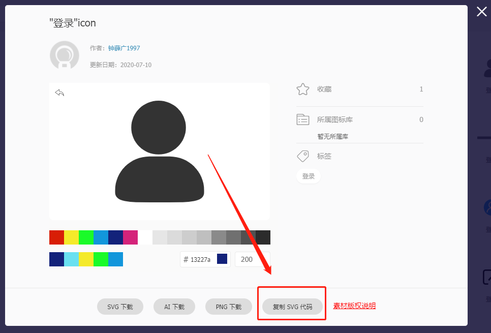
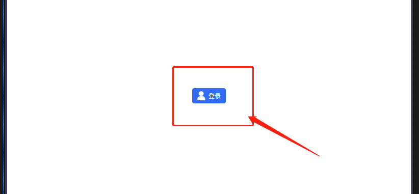

# 扩展按钮图标

`HandyControl` 默认的按钮图标肯定是不够我们使用的，其默认图标文档如下：

https://handyorg.github.io/handycontrol/basic_xaml/geometries/

目前默认带有的图标如下：


## 扩展原理

一般的按钮图标都普遍采用两种方式： `iconfont` 和 `svg` 。

相比之下， `iconfont` 使用起来容易，但是有一定的弊端，例如：项目不好维护等等， `AduSkin` 就是采用了这种方式。

`svg` 的优点在于它是**矢量图**，不会失真，同时也**更容易进行维护**，因为都是一个一个的独立文件嘛。 `HandyControl` 就是采用了 `SVG` 的方式来实现的图标。

所以， `HandyControl` 的扩展原理就是扩展项目中的 `svg` 库。

## 扩展方式

### Step1. 首先建立资源字典

在 `WPF` 中， `SVG` 叫做**几何形状**（ `Geometry` ），我们新建一个存储 `SVG` 的**资源字典**，起名为 `Geometries.xaml` ，路径为： `Resources/Themes/Basic/Geometries.xaml` ，并将其引入到 `App.xaml` 文件中

> [!tip|label:提示]
> 引入到 `App.xaml` 文件中需要按照自己的项目风格哦！


### Step2. 往资源字典中添加几何图形资源

从[iconfont](https://www.iconfont.cn/)网站上下载需要的SVG图标，比如我们找一个登录图标，如下所示：



选择**复制svg代码**，这样剪切板上就会复制到如下内容:

```xml
<svg t="1629125142627" class="icon" viewBox="0 0 1024 1024" version="1.1" xmlns="http://www.w3.org/2000/svg" p-id="2764" width="200" height="200"><path d="M614.015 562.226H409.928c-191.021 0-346.487 153.046-346.487 341.29v20.07C63.441 1024 216.36 1024 409.928 1024h204.087c185.927 0 346.46 0 346.5-100.413v-20.121c0-188.156-155.48-341.291-346.5-341.291zM501.77 0C350.075 0 226.7 121.566 226.7 271.02s123.323 271.047 275.07 271.047S776.84 420.475 776.84 271.02 653.454 0 501.771 0z" p-id="2765"></path></svg>
```

接下来在 `Geometries.xaml` 文件中建立Login相关的几何图形资源，如下所示：

```xml
<ResourceDictionary xmlns="http://schemas.microsoft.com/winfx/2006/xaml/presentation"
                    xmlns:x="http://schemas.microsoft.com/winfx/2006/xaml"
                     xmlns:o="http://schemas.microsoft.com/winfx/2006/xaml/presentation/options">
    <Geometry o:Freeze="True" x:Key="LoginGeometry">M614.015 562.226H409.928c-191.021 0-346.487 153.046-346.487 341.29v20.07C63.441 1024 216.36 1024 409.928 1024h204.087c185.927 0 346.46 0 346.5-100.413v-20.121c0-188.156-155.48-341.291-346.5-341.291zM501.77 0C350.075 0 226.7 121.566 226.7 271.02s123.323 271.047 275.07 271.047S776.84 420.475 776.84 271.02 653.454 0 501.771 0z</Geometry>
</ResourceDictionary>
```

> [!tip|label:提示]
> 做法就是建立一个 `Geometry` 元素，其中 `x: Key` 属性为自定义的名称，元素内容就是 `SVG` 中的 `path.d` 的值！


### Step3. 页面引入

在页面中按照如下方式引入即可：

```xml
<Button Style="{StaticResource ButtonPrimary}" Content="登录" hc:IconElement.Geometry="{StaticResource LoginGeometry}"/>
```

效果：

