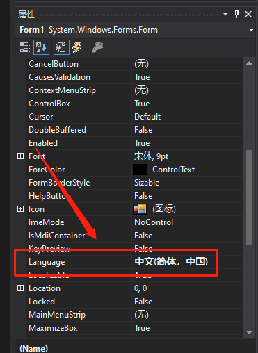
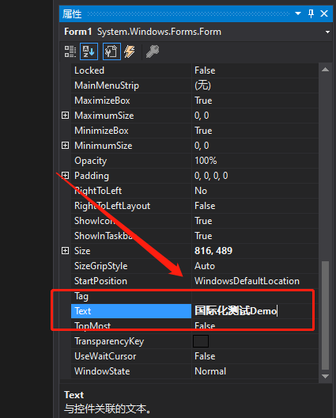

# 国际化

`WinForm` 应用本身提供了国际化支持，我们可以很方便的采用这种方式来实现国际化需求。

搭建 `Demo` 工程，新建 `WinFrom` 应用，选择 `.NetFramework 4.6.2` 版本。

## 添加简体中文支持

在**属性**编辑器中，将语言选择为 `中文(简体，中国)` ，如下所示：



之后往下拉，找到 `Text` 属性，将默认的 `Form1` 更改为**国际化测试Demo**并保存，就会发现项目中自动生成了资源文件。如下所示：



生成的中文语言资源文件如下所示：


::: warning 注意
关于简体中文，在这里有很多种选择，一定要注意选择是 `中文(简体，中国)` ，不能是 `中文(简体)` 这样的，因为最后生成的资源文件名称不是 `zh-CN` 这种，可能是 `zh-Hans` 这种，我们习惯了中文简体都是 `zh-CN` ，这点要注意！
:::

## 添加英文支持

在**属性**编辑器中，将语言选择为 `英语(美国)` ，如下所示：


更改 `Text` 内容，之后保存，就能看到生成的英文语言资源文件了，如下所示：


## 编写帮助类

编写 `LanguageHelper` 类，写入如下内容：

```csharp
using System;
using System.ComponentModel;
using System.Globalization;
using System.Windows.Forms;

namespace I18n
{
    public class LanguageHelper
    {

        #region SetLang
        /// <summary>
        /// 设置语言
        /// </summary>
        /// <param name="lang">language:zh-CN, en-US</param>
        /// <param name="form">the form you need to set</param>
        /// <param name="formType">the type of the form </param>
        public static void SetLang(string lang, Form form, Type formType)
        {
            System.Threading.Thread.CurrentThread.CurrentUICulture = new CultureInfo(lang);
            if (form != null)
            {
                ComponentResourceManager resources = new ComponentResourceManager(formType);
                resources.ApplyResources(form, "$this");
                AppLang(form, resources);
            }
        }
        #endregion

        #region AppLang for control
        /// <summary>
        ///  loop set the propery of the control
        /// </summary>
        /// <param name="control"></param>
        /// <param name="resources"></param>
        private static void AppLang(Control control, ComponentResourceManager resources)
        {
            if (control is MenuStrip)
            {
                resources.ApplyResources(control, control.Name);
                MenuStrip ms = (MenuStrip)control;
                if (ms.Items.Count > 0)
                {
                    foreach (ToolStripMenuItem c in ms.Items)
                    {
                        AppLang(c, resources);
                    }
                }
            }

            foreach (Control c in control.Controls)
            {
                resources.ApplyResources(c, c.Name);
                AppLang(c, resources);
            }
        }
        #endregion

        #region AppLang for menuitem
        /// <summary>
        /// set the toolscript 
        /// </summary>
        /// <param name="item"></param>
        /// <param name="resources"></param>
        private static void AppLang(ToolStripMenuItem item, ComponentResourceManager resources)
        {
            if (item is ToolStripMenuItem item1)
            {
                resources.ApplyResources(item, item.Name);
                ToolStripMenuItem tsmi = item1;
                if (tsmi.DropDownItems.Count > 0)
                {
                    foreach (ToolStripMenuItem c in tsmi.DropDownItems)
                    {
                        AppLang(c, resources);
                    }
                }
            }
        }
        #endregion
    }
}
```

## 语言切换

语言切换非常简单，只需要一行即可，如下所示：

```csharp
LanguageHelper.SetLang("zh-CN", this, typeof(Form1)); // 设置中文
LanguageHelper.SetLang("en-US", this, typeof(Form1)); // 设置英文
```

一些辅助方法：

```csharp
string language = System.Globalization.CultureInfo.InstalledUICulture.Name; //获取当前系统的语言
string language = System.Globalization.CultureInfo.CurrentUICulture.Name; //获取软件当前语言
```

## 案例工程

[九星Git](https://git.9xing.cn/pc_client_software/demos/i18n)