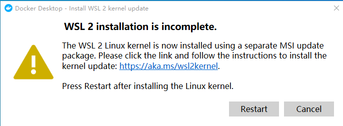

# Windows10安装

在 `Windows` 环境下可以直接安装 `Docker Desktop` 软件即可。

## 下载

从[官网](https://www.docker.com/products/docker-desktop)下载即可。**先不要着急安装**！！！

## 修改安装地址

由于 `Docker Desktop Installer` 的**默认安装地址**为 `C盘` ，**也不让选择**，因此我们需要先设置一个 `软连接` ，将 `C:\Program Files\Docker` 指到 `D盘` 下面，这样之后再安装的时候就直接安装到 `D盘` 了（需要先建立： `D:\Program Files\Docker` 文件夹）

```bash
$ mklink /j "C:\Program Files\Docker" "D:\Program Files\Docker"
Junction created for C:\Program Files\Docker <<===>> D:\Program Files\Docker
```

> [!warning]
> 此命令**必须以管理员身份运行 `CMD` 才可以**，普通用户是没有权限的。

## 安装

双击安装即可，注意勾选 `WSL2` 。安装完成后会要求**重启**。重启后可能会提示如下：



请参考附录：[Linux内核更新](#linux内核更新)

## 配置

### 启用Docker Compose

对于 `Windows` 环境， `Docker Compose` 不用像 `Linux` 那样下载二进制文件， `Docker Desktop` 已经集成了此功能，只需要在**设置**中开启即可，操作如下所示：


### 配置阿里云容器镜像加速器

在天朝开发嘛，懂得都懂。


## 附录

### Linux内核更新

点击提示框的连接，跳转到微软官方下载页面，如下所示：


点击下载连接进行下载即可。下载后的文件名叫： `wsl_update_x64.msi` ，双击安装即可。

### 文件迁移

#### 原因

默认 `Docker Desktop` 安装在 `C盘` ，并且后面所有的镜像，容器等等都运行在 `C盘` ，会导致 `C盘` 占用过大。我们当然是想将其安装到其他盘符了。目前大家普遍使用的应该是 `wsl2` ，之前的就不介绍了（之前版本迁移更容易，网上查一下即可。）

`docker desktop` 在安装的时候创建两个 `wsl` 子系统。分别是： `docker-desktop` 和 `docker-desktop-data` 。通过命令 `wsl -l -v --all` 来查看一下当前系统中的 `wsl` 子系统。

```bash
$ wsl -l -v --all
  NAME                   STATE           VERSION
* docker-desktop         Running         2
  docker-desktop-data    Running         2
```

`docker-desktop` 是存放程序的， `docker-desktop-data` 是存放镜像的，这两个 `wsl` 子系统都是默认放在**系统盘**的。

[官方issue](https://github.com/docker/for-win/issues/5829#issuecomment-622442186)

> [!note]
> 官方 `issue` 的意思是只需要迁移 `docker-desktop-data` 这个 `wsl` 系统即可， `docker-desktop` 并不必进行迁移。

### 迁移

首先将**Docker停止**，有正在运行的容器也全部停掉。

#### `Step1.` 导出 `wsl` 子系统镜像

打开 `cmd` 终端，注意下面两条命令会在当前位置生成一个文件： `docker-desktop-data.tar` ，所以还是找一个特定的位置打开 `cmd` 吧。

```bash
$ wsl --export docker-desktop-data docker-desktop-data.tar
```

> 如果正常，应该会在此文件夹下看到一个文件：： `docker-desktop-data.tar`

#### `Step2.` 删除现有的 `wsl` 子系统

```bash
$ wsl --unregister docker-desktop-data
正在注销...
```

#### `Step3.` 重新创建 `wsl` 子系统

先在想要放置数据的位置创建个文件夹，我是在 `D盘` 下创建了 `DockerDesktopData` 文件夹，用来存储 `docker-desktop-data` 和 `wsl` 子系统数据的。

```bash
$ wsl --import docker-desktop-data D:\DockerDesktopData D:\docker-desktop-data.tar --version 2
```

#### `Step4.` 重启电脑
