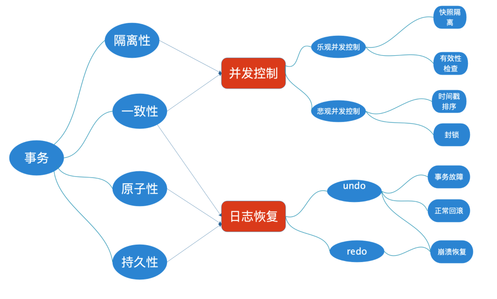

# 事务

参考文章：

[博客园： 数据库事务的概念及其实现原理](https://www.cnblogs.com/takumicx/p/9998844.html) 

[博客园：数据库事务的概念及其实现原理](https://www.cnblogs.com/takumicx/p/9998844.html)

先上要记住的结论：

|事务隔离级别|脏写|脏读|丢失更新|不可重复读|幻读|
|:-----:|:-----:|:-----:|:-----:|:-----:|:-----|
|读未提交（read-uncommitted）||可能|可能|可能|可能|
|不可重复读（read-committed）|||可能|可能|可能|
|可重复读（repeatable-read）|||||可能|
|串行化（serializable）|||||||

## 什么是数据库事务

`定义:` **数据库事务是构成单一逻辑工作单元的操作集合**

## 事务的基本要素(ACID)

1. `原子性（Atomicity）：` 事务开始后所有操作，要么全部做完，要么全部不做，不可能停滞在中间环节。事务执行过程中出错，会回滚到事务开始前的状态，所有的操作就像没有发生一样。也就是说事务是一个不可分割的整体，就像化学中学过的原子，是物质构成的基本单位。
2. `一致性（Consistency）：` 事务开始前和结束后，数据库的完整性约束没有被破坏 。比如A向B转账，不可能A扣了钱，B却没收到。
3. `隔离性（Isolation）：` 同一时间，只允许一个事务请求同一数据，不同的事务之间彼此没有任何干扰。比如A正在从一张银行卡中取钱，在A取钱的过程结束前，B不能向这张卡转账。
4. `持久性（Durability）：` 事务完成后，事务对数据库的所有更新将被保存到数据库，不能回滚。

### ACID实现原理

在事务的ACID特性中, C即 `一致性是事务的根本追求` , 而对数据一致性的破坏主要来自两个方面

1. 事务的并发执行
2. 事务故障或系统故障

数据库系统是通过 `并发控制技术` 和 `日志恢复技术` 来避免这种情况发生的。

`并发控制技术` 保证了事务的隔离性, 使数据库的一致性状态不会因为并发执行的操作被破坏。

`日志恢复技术` 保证了事务的原子性, 使一致性状态不会因事务或系统故障被破坏。同时使已提交的对数据库的修改不会因系统崩溃而丢失, 保证了事务的持久性。

## 事务并发问题

### 脏写

脏写是指事务回滚了其他事务对数据项的已提交修改, 比如下面这种情况：

|事务1|事务2|
|-----|-----|
|read(A)=10|
||read(A)=10|
||write(A)=30|
||Commit|
|write(A)=20||
|Rollback(A=10)||

在事务1对数据A的回滚, 导致事务2对A的已提交修改也被回滚了。

### 丢失更新

丢失更新是指事务覆盖了其他事务对数据的已提交修改, 导致这些修改好像丢失了一样。

|事务1|事务2|
|-----|-----|
||read(A)=10|
|read(A)=10||
||A:=A+10|
||Commit|
|A:=A-10||
|Commit||

事务1和事务2读取A的值都为10, 事务2先将A加上10并提交修改, 之后事务1将A减少10并提交修改, A的值最后为0, 导致事务2对A的修改好像丢失了一样。

### 脏读

脏读是指 `一个事务读取了另一个事务未提交的数据` 。

|事务1|事务2|
|-----|-----|
|read(A)=10||
|A: A*2||
|write(A)||
||read(A)=20|
|rollback(A=10)||

在事务1对A的处理过程中, 事务2读取了A的值, 但之后事务1回滚, 导致事务2读取的A是未提交的脏数据。

### 不可重复读

不可重复读是指一个事务对同一数据的读取结果前后不一致。脏读和不可重复读的区别在于: `前者读取的是事务未提交的脏数据, 后者读取的是事务已经提交的数据` , 只不过因为数据被其他事务修改过导致前后两次读取的结果不一样。

|事务1|事务2|
|-----|-----|
|read(A)=10||
||read(A)=10|
||A: A*2|
||write(A)=20|
||commit|
|read(A)=20||

由于事务2对A的已提交修改, 事务1前后两次读取的结果不一致。

### 幻读

幻读是指事务读取某个范围的数据时，因为其他事务的操作导致前后两次读取的结果不一致。幻读和不可重复读的区别在于, 不可重复读是针对确定的某一行数据而言, 而幻读是针对不确定的多行数据。因而幻读通常出现在带有查询条件的范围查询中。

|事务1|事务2|
|-----|-----|
|read(A<5)=(1, 2, 3)||
||write(A)=4|
||Commit|
|read(A<5)=(1, 2, 3, 4)||

事务1查询A<5的数据, 由于事务2插入了一条A=4的数据, 导致事务1两次查询得到的结果不一样

## 事务的隔离级别

* 事务具有隔离性, 理论上来说事务之间的执行不应该相互产生影响, 其对数据库的影响应该和它们串行执行时一样。
* 然而完全的隔离性会导致系统并发性能很低, 降低对资源的利用率, 因而实际上对隔离性的要求会有所放宽, 这也会一定程度造成对数据库一致性要求降低
* SQL标准为事务定义了不同的隔离级别, 从低到高依次是
  + `读未提交` (READ UNCOMMITTED)
  + `读已提交` (READ COMMITTED)
  + `可重复读` (REPEATABLE READ)
  + `串行化` (SERIALIZABLE)

``` mermaid
graph TD;
    0["无事务"] -- "脏写、脏读、丢失更新、不可重复读、幻读" --> A;
    A["读未提交(READ UNCOMMITTED)"] -- "脏读、丢失更新、不可重复读、幻读" --> B["读已提交(READ COMMITTED)"];
    B -- "丢失更新、不可重复读、幻读" --> C["可重复读 (REPEATABLE READ)"];
    C -- 幻读 --> D["串行化 (SERIALIZABLE)"]
```

**事务的隔离级别越低, 可能出现的并发异常越多, 但是通常而言系统能提供的并发能力越强。**

|事务隔离级别|脏写|脏读|丢失更新|不可重复读|幻读|
|:-----:|:-----:|:-----:|:-----:|:-----:|:-----|
|读未提交（read-uncommitted）||可能|可能|可能|可能|
|不可重复读（read-committed）|||可能|可能|可能|
|可重复读（repeatable-read）|||||可能|
|串行化（serializable）|||||||

所有事务隔离级别都不允许出现脏写, 而串行化可以避免所有可能出现的并发异常, 但是会极大的降低系统的并发处理能力。
