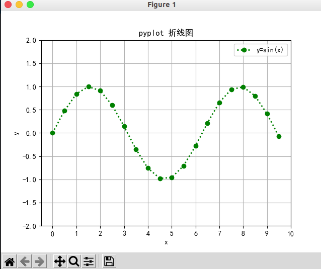

# 折线图

## 单线

如果我们想自定义坐标轴的**标题**，坐标轴的**刻度**，坐标轴**刻度的范围**，设置**图形标题**，添加**图例**时，可以通过设置 `pyplot` 函数中的 `xlable` （横坐标轴标题）, `ylabel` （纵坐标轴标题）, `xticks` （横坐标轴刻度）， `yticks` （纵坐标轴刻度）， `title` （图形标题）, `grid` （显示网格）， `legend` （显示图例）等属性来实现。

示例：

```py
from matplotlib import pyplot as plt
import numpy as np

# 这两行代码使得 pyplot 画出的图形中可以显示中文
plt.rcParams['font.sans-serif'] = ['SimHei']
plt.rcParams['axes.unicode_minus'] = False

# 生成数据
x = np.arange(0, 10, 0.5)
y = np.sin(x)

# 生成图形
plt.plot(x, y, 'go:', label='y=sin(x)', linewidth=2) # 颜色绿色，点形圆形，线性虚线，设置图例显示内容，线条宽度为2

plt.ylabel('y') # 横坐标轴的标题
plt.xlabel('x') # 纵坐标轴的标题
plt.xticks(np.arange(0, 11, 1)) # 设置横坐标轴的刻度为 0 到 10 的数组
plt.ylim([-2, 2]) # 设置纵坐标轴范围为 -2 到 2
plt.legend() # 显示图例, 图例中内容由 label 定义
plt.grid() # 显示网格
plt.title('pyplot折线图') # 图形的标题

# 显示图形
plt.show()
```



## 多线

下表是我国近 `10` 年的 `GDP` 增长率，以及三大产业在近 `10` 年的增长率。

|时间|	GDP增长率	|第一产业增长率	|第二产业增长率|	第三产业增长率|
|-----|-----|-----|-----|-----|
|2009年|9.4|4|10.3|9.6|
|2010年|10.6|4.3|12.7|9.7|
|2011年|9.6|4.2|10.7|9.5|
|2012年|7.9|4.5|8.4|8|
|2013年|7.8|3.8|8|8.3|
|2014年|7.3|4.1|7.4|7.8|
|2015年|6.9|3.9|6.2|8.2|
|2016年|6.7|3.3|6.3|7.7|
|2017年|6.8|4|5.9|7.9|
|2018年|6.6|3.5|5.8|7.6|

在画图时，横坐标轴数据为年份，纵坐标轴数据分别为 `GDP` 增长率，第一产业增长率，第二产业增长率，第三产业增长率。为了将四个纵坐标轴数据显示在一个图形上，可以用四个 `plot` 函数进行划线。

示例代码：

```py
from matplotlib import pyplot as plt

# 这两行代码解决 plt 中文显示的问题
plt.rcParams['font.sans-serif'] = ['SimHei']
plt.rcParams['axes.unicode_minus'] = False

# 输入纵坐标轴数据与横坐标轴数据
gdp_rate = [9.4, 10.6, 9.6, 7.9, 7.8, 7.3, 6.9, 6.7, 6.8, 6.6]
first_industry_rate = [4.0, 4.3, 4.2, 4.50, 3.8, 4.1, 3.9, 3.3, 4.0, 3.5]
second_industry_rate = [10.3, 12.7, 10.7, 8.4, 8.0, 7.4, 6.2, 6.3, 5.9, 5.8]
third_industry_rate = [9.6, 9.7, 9.5, 8.0, 8.3, 7.8, 8.2, 7.7, 7.9, 7.6]
years = [2009, 2010, 2011, 2012, 2013, 2014, 2015, 2016, 2017, 2018]

# 4 个 plot 函数画出 4 条线，线形为折线，每条线对应各自的标签 label
plt.plot(years, gdp_rate, '.-', label='GDP增长率')
plt.plot(years, first_industry_rate, '.-', label='第一产业增长率')
plt.plot(years, second_industry_rate, '.-', label='第二产业增长率')
plt.plot(years, third_industry_rate, '.-', label='第三产业增长率')

plt.xticks(years)  # 设置横坐标刻度为给定的年份
plt.xlabel('年份') # 设置横坐标轴标题
plt.legend() # 显示图例，即每条线对应 label 中的内容
plt.show() # 显示图形
```


