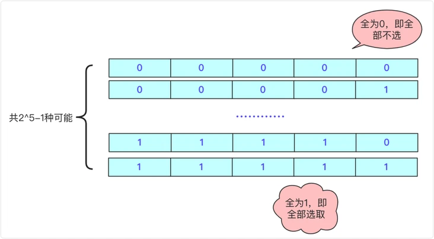

# 小技巧

## 判断奇偶

```c
if(n & 1 == 1){
  // n 是个奇数。
}
```

其核心就是判断二进制的**最后一位是否为1**，如果为 `1` 那么结果加上 `2^0=1` 一定是个奇数，否则就是个偶数。

## 交换两个数

```c
a=a^b;  //a=a^b
b=a^b;  //b=(a^b)^b=a^0=a
a=a^b;  //a=(a^b)^(a^b^b)=0^b=b
```

## 二进制枚举

在遇到子集问题的处理时候，我们有时候会借助**二进制枚举**来遍历各种状态(效率大于 `dfs` 回溯)。这种就属于**排列组合**的问题了，对于每个物品(位置)来说，就是使用和不使用的两个状态，而在二进制中刚好可以用 `1` 和 `0` 来表示。而在实现上，通过枚举数字范围分析每个二进制数字各符号位上的特征进行计算求解操作即可。



二进制枚举的代码实现为：

```c
for(int i = 0; i < (1<<n); i++) //从0～2^n-1个状态
{
  for(int j = 0; j < n; j++) //遍历二进制的每一位 共n位
  {
    if(i & (1 << j))//判断二进制数字i的第j位是否存在
    {
      //操作或者输出
    }
  }
}
```
