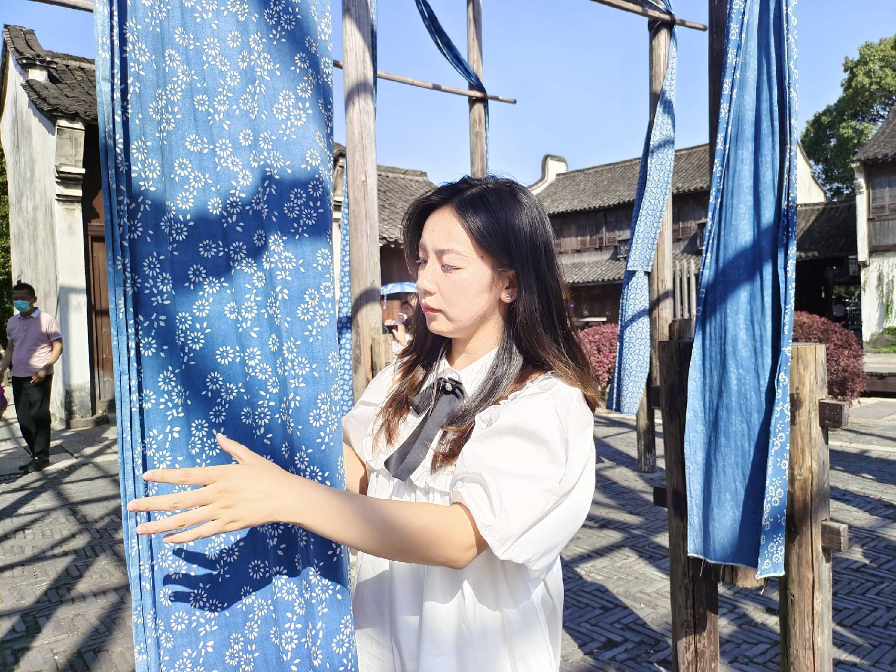
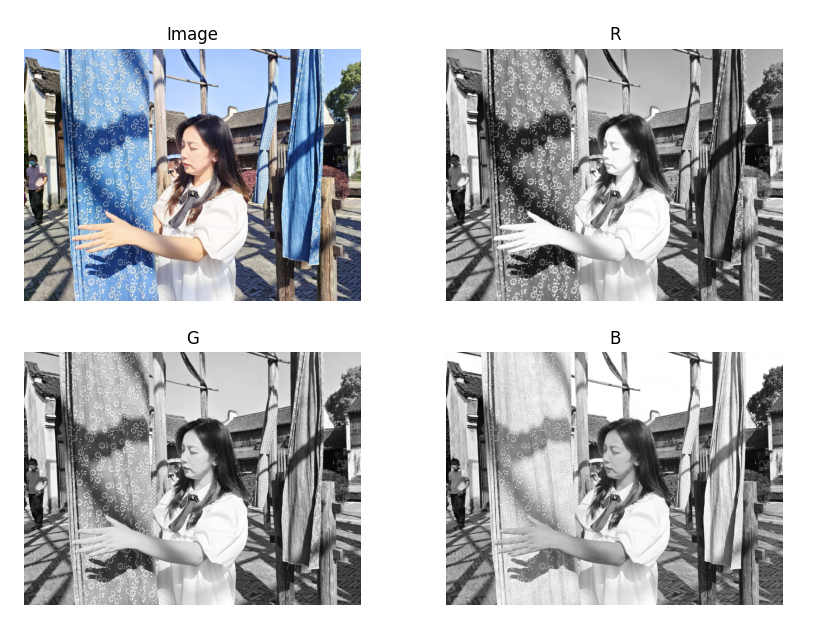
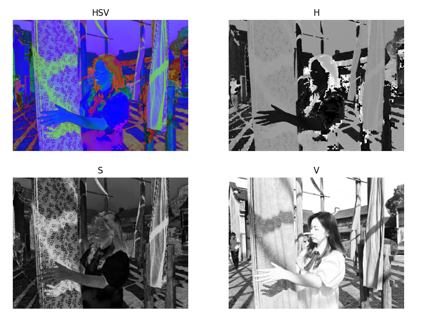
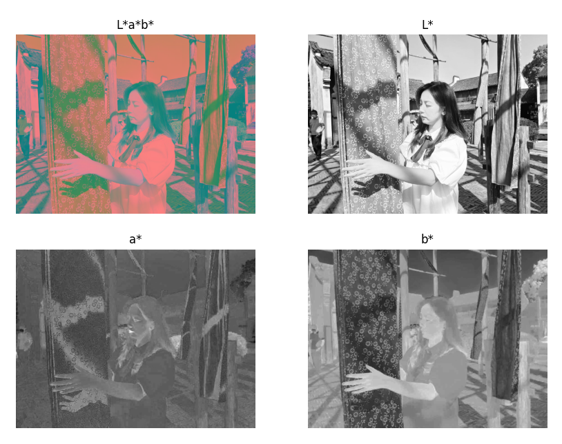

# Demo 工程

[工程下载](https://megrez-file.virtualbing.cn/%E9%9F%B3%E8%A7%86%E9%A2%91/%E5%9B%BE%E7%89%87%E5%9F%BA%E7%A1%80/%E9%A2%9C%E8%89%B2%E6%A8%A1%E5%9E%8B/Demo%E5%B7%A5%E7%A8%8B/project.zip)

素材图片： `demo.jpeg`



## 环境配置

```shell
$ conda create -n color-model python=3.9
$ conda activate color-model
$ pip install -r requirements.txt
```

## RGB

`RGB` 颜色空间在文件 `rgb.py` 中演示，效果如下：



::: details rgb.py 内容

```python
import cv2
import numpy as np
from matplotlib import pyplot as plt

pic_file = 'demo.jpeg'

img_bgr = cv2.imread(pic_file, cv2.IMREAD_COLOR)  # OpenCV读取颜色顺序：BGR
img_b = img_bgr[..., 0]
img_g = img_bgr[..., 1]
img_r = img_bgr[..., 2]
fig = plt.gcf()  # 图片详细信息

fig = plt.gcf()  # 分通道显示图片
fig.set_size_inches(10, 15)

plt.subplot(221)
plt.imshow(np.flip(img_bgr, axis=2))  # 展平图像数组并显示
plt.axis('off')
plt.title('Image')

plt.subplot(222)
plt.imshow(img_r, cmap='gray')
plt.axis('off')
plt.title('R')

plt.subplot(223)
plt.imshow(img_g, cmap='gray')
plt.axis('off')
plt.title('G')

plt.subplot(224)
plt.imshow(img_b, cmap='gray')
plt.axis('off')
plt.title('B')

plt.show()
```

:::

## HSV

`HSV` 颜色空间在文件 `hsv.py` 中演示，效果如下：



::: details hsv.py 内容

```python
import cv2
import numpy as np
from matplotlib import pyplot as plt

pic_file = 'demo.jpeg'

img_bgr = cv2.imread(pic_file, cv2.IMREAD_COLOR)  # OpenCV读取颜色顺序：BGR

img_hsv = cv2.cvtColor(img_bgr, cv2.COLOR_BGR2HSV)
img_h = img_hsv[..., 0]
img_s = img_hsv[..., 1]
img_v = img_hsv[..., 2]

fig = plt.gcf()                      # 分通道显示图片
fig.set_size_inches(10, 15)

plt.subplot(221)
plt.imshow(img_hsv)
plt.axis('off')
plt.title('HSV')

plt.subplot(222)
plt.imshow(img_h, cmap='gray')
plt.axis('off')
plt.title('H')

plt.subplot(223)
plt.imshow(img_s, cmap='gray')
plt.axis('off')
plt.title('S')

plt.subplot(224)
plt.imshow(img_v, cmap='gray')
plt.axis('off')
plt.title('V')

plt.show()
```

:::

## L\*a\*b\*

`L*a*b*` 颜色空间在文件 `Lab.py` 中演示，效果如下：



::: details Lab.py 内容

```python
import cv2
import numpy as np
from matplotlib import pyplot as plt

pic_file = 'demo.jpeg'

img_bgr = cv2.imread(pic_file, cv2.IMREAD_COLOR)  # OpenCV读取颜色顺序：BGR

img_lab = cv2.cvtColor(img_bgr, cv2.COLOR_BGR2LAB)
img_ls = img_lab[..., 0]
img_as = img_lab[..., 1]
img_bs = img_lab[..., 2]

# 分通道显示图片
fig = plt.gcf()
fig.set_size_inches(10, 15)

plt.subplot(221)
plt.imshow(img_lab)
plt.axis('off')
plt.title('L*a*b*')

plt.subplot(222)
plt.imshow(img_ls, cmap='gray')
plt.axis('off')
plt.title('L*')

plt.subplot(223)
plt.imshow(img_as, cmap='gray')
plt.axis('off')
plt.title('a*')

plt.subplot(224)
plt.imshow(img_bs, cmap='gray')
plt.axis('off')
plt.title('b*')

plt.show()
```

:::
