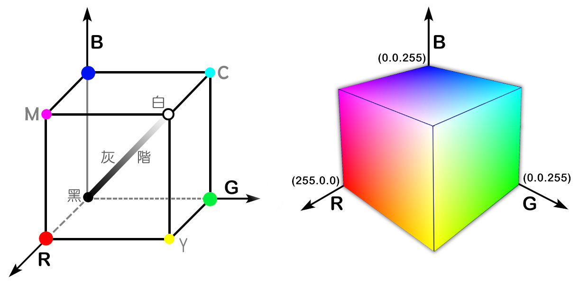

# RGB颜色模型

`RGB` 是普通人最常见的的颜色模型，由于最早的彩色显示器采用**光的三色**（红绿蓝）来显示所有色彩，所以 `RGB` 颜色模型也最早进入普通人的视线。

`RGB` 模型的来源是显示行业，因此对于机器来说是非常友好的，但是人就很难理解了。

## RGB立方体

根据**光的三原色**原理，用原色光单位来表示光的量，则在 `RGB` 颜色空间，任意色光 `F` 都可以用 `R` 、 `G` 、 `B` 三色不同分量的相加混合而成：$F=R_{[r]}+G_{[g]}+B_{[b]}$

我们可知自然界中任何一种色光都可由 `R` 、 `G` 、 `B` 三基色按不同的比例相加混合而成，当三基色分量都为 `0` （最弱）时混合为**黑色光**；当三基色分量都为 `k` （最强）时混合为**白色光**。任一颜色 `F` 是这个立方体坐标中的一点，调整三色系数 `r` 、 `g` 、 `b` 中的任一系数都会改变 `F` 的坐标值，也即改变了 `F` 的**色值**。 `RGB` 颜色空间采用物理三原色表示，因而物理意义很清楚，适合彩色显像管工作。然而这一体制并不适应人的视觉特点。

